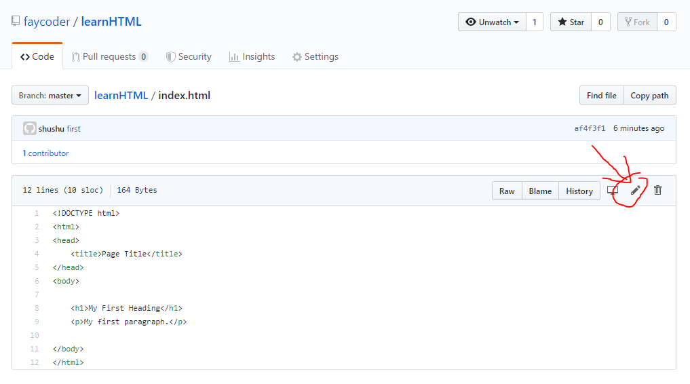

## 超文本标记语言

书接上回，上次我们说到只需要【右键-查看网页源代码】就可以看到网页是怎么写的了，今天我们就要详细的解释一下里面到底写的是什么了。不过淘宝太大了，我们从一个简单的网页开始，最简单的网页就从世界上第一个网页开始吧。
地址就在 http://info.cern.ch/hypertext/WWW/TheProject.html 这个网页可厉害了，它比我们两个只小一岁。没想象那么老是不是，计算机这个领域就是这样，这个领域太新了，甚至很多教科书里提到的大师们还都活着。

也许领导已经注意到了，这个网页写的就是“达不溜达不溜达不溜”，到底www什么意思呢，我们回头再说。今天先看看这个网页的源代码到底写了什么。我把源代码稍微改了一点点贴在下面

    <HEADER>
        <TITLE>The World Wide Web project</TITLE>
        <NEXTID N="55">
    </HEADER>
    <BODY>
        <H1>World Wide Web</H1>
        <!---省略了--->
    </BODY>

省略了很多东西，这样我们就能看见整个框架了。我们可以观察到，有很多用尖括号括起来的东西，比如`<HEADER>`和`<TITLE>`，而且都是一对一对出现的。我们把这一对东西加上括起来的部分叫`HTML element`，中文翻译叫`HTML元素`。
那什么又是HTML呢？HTML全称超文本标记语言，是一种程序语言（严格说不是写程序的语言）。而尖括号里面的东西，叫`HTML tag`。

> 这里插入一个笑话，A programmer knows HTML, but he doesn't know How To Make Love

也许领导注意到了，我在`<TITLE>`前面加了几个空格。在HTML（和很多编程语言里），空格是没用的，只是为了让人看起来更舒服。因为`<TITLE>`被`<HEADER>`包在了里面，所以我们用几个空格把它放在右边，这样一眼可以看出谁在外面谁在里面。

如果把这些元素的关系画出来，他们是这样的


如果倒过来看，好像是一个树，一个树干长出两个树枝，一个树枝又长出两个小树枝。没错，这就是编程里很重要的概念，就叫做树。
后面我们会不停不停的遇到这个概念，不夸张的说，如果搞明白了各种树，基本就可以找到工作啦！

省略的东西都有什么呢，主要就是文字了，在`<BODY>`标签里直接出现的文字，会（几乎）原样的显示在网页上。但是一般来说，我们都会把文字放在`<p>`标签里面。

## 标签

`<TITLE>`还算好理解一点，`<A>`和`<P>`名字也太抽象了。它们名字很短很抽象，因为它们很常用，程序员们为了少敲几下键盘，就用了最少的字母。

`<H1>`意思是heading，被它括起来的文字会变大。和它类似的还有`<H2>``<H3>``<H4>`

    `<H1>我是标题</H1>`

会显示成：
<div id='demo' style="border: 1px solid black;margin: 10px;padding:10px;">
<H1>我是标题</H1>
</div>


`<P>` 意思是paragraph，被它括起来的文字会另起一行。

    ```
    <p>第一段</p><p>第二段</p>
    ```

<div id='demo2' style="border: 1px solid black;margin: 10px;padding:10px;">
<p>第一段</p>
<p>第二段</p>
</div>

`<A>` 意思是anchor，被它括起来的文字会变成可以点的链接，链到另一个网页

    `<a href="http://www.baidu.com">我是链接</a>`

<div id='demo2' style="border: 1px solid black;margin: 10px;padding:10px;">
<a href="http://www.baidu.com">我是链接</a>   
</div>

注意到`href=`了吗，这个定义了链接指向哪个网址，而这种`href=""`叫做attriube，除了href还有很多种其他的attribute，比如`style=`定义了怎么样显示这个element。


## 领导的第一个网页

得益于很多公司提供了各种免费服务，现在在网上发布一个网页非常简单，还不花钱。而且账号我都给领导申请好了，今天这篇看完，领导就能做出第一个网页了！
偷偷说一句，这篇文章还有给领导的一句话也是放在了同样的地方，而且我估计只需要5-6篇文章，领导就可以做一个给我写的一句话网页了~

首先我们来登陆 http://github.com ，这个网站是全世界程序员的facebook或者朋友圈。点击右上角的login，我已经帮领导注册好一个账号了，用户名密码私信找我要哦。

登陆以后是这样的：


左上角显示了领导的账号里已经存在的项目，hello-world 是注册时候自动创建的，以后我们学习和别人一起写代码时候再用。
`faycoder/guide`就是这一系列文章所在地了。而`faycoder/learnHTML`就是领导学习HTML的地方了，点进去正中间显示了已经存在的文件，我已经帮领导创建了index.html,
点开以后是这样的:



点红圈圈出来的那个笔，就可以编辑了。领导可以在里面随便写一些什么东西编辑好了在最下面点击Commit changes，提交领导的修改。

最后，赶紧去 https://faycoder.github.io/learnHTML/index.html 看看成果吧！

领导可能注意到了，我们自己写的网页和www那个网页不太一样，这是因为那个网页太早了，现在有一些格式已经和以前不太一样了，比如所有的tag现在一般都是小写的，而当初是大写的。
还比如以前`<p>`是单独存在的，而现在是成对出现的。而我们自己写的网页第一行`<!DOCTYPE html>`意思就是告诉浏览器，这个网页的格式是什么。

等领导真的要写代码时候就会发现，超过一半的时间其实是在网上找例子，而学习HTML也一样。领导可以去 https://www.w3schools.com/html/html_intro.asp 
这里看一下，这里的教程是HTML标准委员会写的，所有关于HTML的东西都可以找到。

## 作业

最后给领导留两个小作业

1. 修改我们的网页，写下领导想写的内容

2. 试一下`<title>`的意思，它会显示在哪里呢？小提示`<title>`标签应该在`<head>`标签里面，现在叫`<head>`了，以前叫`<header>`

下一篇文章，我们来讲讲怎么插入图片，还有到底什么是www。